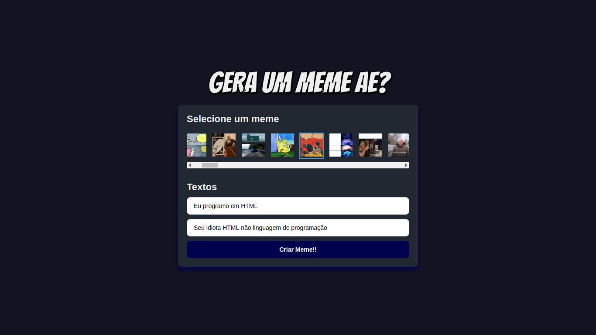
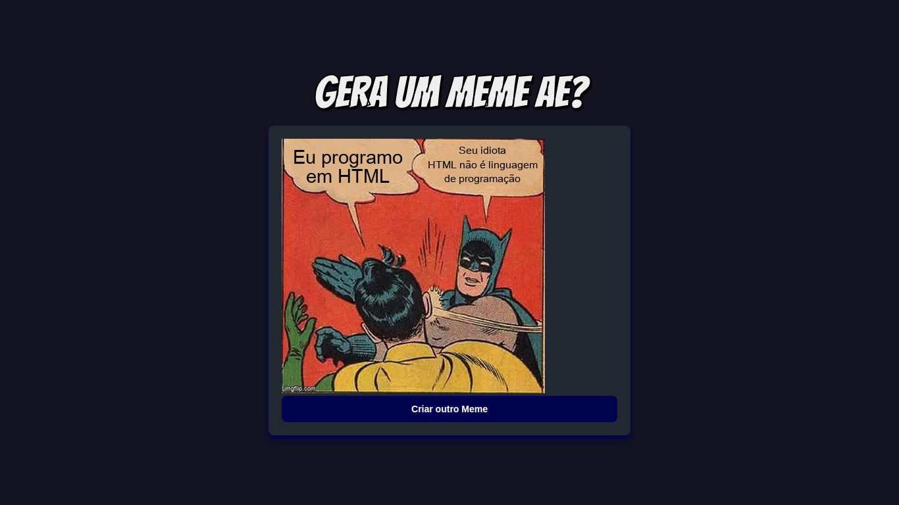

<h1 align="center"> <strong>🥴 MemeGenerator</strong></h1>

<p align="center">
  
  
</p>

<h4 align="center"></h4>


<br />
<p align="center"></p>
<p align="center"></p>

# 📕 About

🤪 Application made to generate personalized memes. For you to have fun with your friends.
</br>

# 🛠️Technologies 

This project was made using the follow technologies:

- [ReactJS](https://reactjs.org/)
- [Styled Components](https://styled-components.com/)
- [VS Code](https://code.visualstudio.com/)


# 🚀Features
* ⚙️ Application consuming the API [ImgFlip](https://imgflip.com/).
* 💅 Stylization made with Styled Components.


# 🏃Getting Started
```sh
#  Clone Repository
$ git clone https://github.com/wesleywcr/MemeGenerator.git 
# Install Dependencies
$ cd web
$ yarn install
$ yarn start

```

# 🤝 Contributing

- Fork this repository
- Create a branch with your feature: `git checkout -b my-feature`
- Commit your changes: `git commit -m 'feat: My new feature'`
- Push your branch: `git push origin my-feature`


# 📝License

Released in 2020.
This project is under the [MIT license](./LICENSE)
Made with ❤️ by [Wesley Rodrigues](https://github.com/wesleywcr)🤙👊